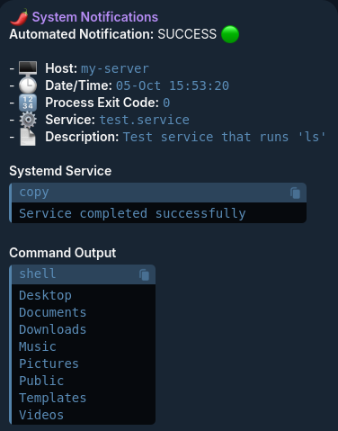

# Telegram Systemd Notifier

Simple, lightweight, zero-dependency Go application that sends Telegram notification messages when systemd services succeed or fail, providing real-time monitoring of Linux systems.

---
<br>

## ✨ Features
**Overall Features**
- **Systemd Support**: Works with both system and user systemd services
- **All Service Types**: Compatible with oneshot, forking, simple, notify, and other service types
- **Comprehensive Monitoring**: Detects execution errors, permission issues, configuration problems, and service state changes
- **Security First**: Input validation, command injection prevention, secret filtering, and rate limiting
- **Privacy Aware**: Optional hostname aliasing and automatic credential redaction from logs
- **Zero Dependencies**: Single static binary with no external runtime dependencies
- **SELinux Compatible**: Proper security context handling for system services
- **Minimal Resource Usage**: Efficient execution with configurable timeouts and rate limits

**Sends Notifications When**
- Systemd execution errors (file not found, permission denied, invalid arguments)
- Minor unit file configuration errors (invalid size/boolean values)
- Service success/failure status with detailed exit codes
- Command output and systemd lifecycle events

**Doesn't Send Notifications When**
- Syntax errors in systemd unit files (missing headers, invalid sections)

---
<br>

## 📋 Requirements
- Linux system with systemd
- Go 1.22 or later (only required if building from source)
- Outbound HTTPS access to `api.telegram.org` (port 443)
- Telegram channel or chat with bot added as admin

---
<br>

## 📁 Required Files

The application uses systemd's native environment configuration:

### Systemd Environment Variable File
File used for main configuration.

```shell
# For User Services
~/.config/environment.d/telegram-notifier.conf

# For System Services
/etc/systemd/system.conf.d/telegram-notifier.conf
```

<br>

**Configuration Reference**

|Variable|Purpose|Default|Example|
|---|---|---|---|
|`TELEGRAM_BOT_TOKEN`|Bot token from @BotFather|**Required**|`1234567890:ABC...`|
|`TELEGRAM_CHAT_ID`|Target chat/channel ID|**Required**|`-1001234567890`|
|`NOTIFIER_HOSTNAME_ALIAS`|Custom hostname for privacy|Actual hostname|`my-server`|
|`TZ`|Timezone for timestamps|System timezone|`America/New_York`, `UTC`|
|`NOTIFIER_COMMAND_TIMEOUT`|Command execution timeout|`30s`|`45s`, `1m`, `2m30s`|
|`NOTIFIER_MAX_OUTPUT_SIZE`|Max notification characters|`2500`|`3000`, `4000`|
|`NOTIFIER_JOURNAL_LOOKBACK`|Log search window|`30s`|`1m`, `5m`, `10m`|

<br>

### Systemd Notification Handler Service

Required for receiving notifications if the service using it fails.

```shell
# For User Services
~/.config/systemd/user/telegram-notify@.service

# For System Services
/etc/systemd/system/telegram-notify@.service
```

---
<br>

## 🔧 Install Binary

**Option 1: Download Pre-built Binary (Recommended)**
```bash
# Download latest release
wget https://raw.githubusercontent.com/Git-User76/Telegram-Notifier/main/telegram-notifier

# Make executable
chmod 700 telegram-notifier

# Move binary to user PATH
mv telegram-notifier ~/.local/bin/

# Move to system PATH for system-wide use
# sudo cp telegram-notifier /usr/local/bin/
# sudo chmod 755 /usr/local/bin/telegram-notifier
```

**Option 2: Build from Source**
```shell
# Clone repository
git clone https://github.com/Git-User76/Telegram-Notifier.git
cd telegram-notifier

# Build to binary "telegram-notifier"
go build -o telegram-notifier cmd/notifier/main.go

# Make executable
chmod 700 telegram-notifier

# Move binary to user PATH
mv telegram-notifier ~/.local/bin/

# Move to system PATH for system-wide use
# sudo cp telegram-notifier /usr/local/bin/
# sudo chmod 755 /usr/local/bin/telegram-notifier
```

<br>

### Step 3: SELinux Configuration (if applicable)

**For User Services**
- No special SELinux context required
- Standard execute permissions are sufficient

**For System Services**
```shell
# Method 1: Use /usr/local/bin (automatic correct context)
sudo cp telegram-notifier /usr/local/bin/

# Method 2: Manually set context
sudo semanage fcontext -a -t bin_t "/path/to/telegram-notifier"
sudo restorecon -v /path/to/telegram-notifier
```

---
<br>

## ⚙️ Configuration

### Get Telegram Credentials

**Create a Telegram Bot**
1. Open Telegram and search for `@BotFather`
2. Start conversation with `@BotFather`
3. Send `/newbot` command
4. Choose a display name (e.g., "System Monitor")
5. Choose a username ending with 'bot' (e.g., `system_monitor_bot`)
6. **Save the bot token (format: `1234567890:ABCdefGHIjklMNOpqrsTUVwxyz`)**

**Get Chat ID**
1. Create a Telegram channel or use existing one
2. Add your bot as an admin to the channel
3. Send at least one message to the channel
4. **Save the chat ID using Telegram API:**

```shell
# Syntax
curl "https://api.telegram.org/bot<BOT_TOKEN>/getUpdates"

# Example
curl "https://api.telegram.org/bot1234567890:ABCdefGHIjklMNOpqrsTUVwxyz/getUpdates"
```

Look for the `"chat":{"id":-1001234567890}` field in the response.

**Test Connection**
```shell
curl -X POST "https://api.telegram.org/bot<BOT_TOKEN>/sendMessage" \
     -d "chat_id=<CHAT_ID>" \
     -d "text=Test message from Linux system"
```

<br>

### Set Environment Variables

Create systemd environment configuration file.

**For User Services**
```shell
# Create configuration directory
mkdir -p ~/.config/environment.d

# Create credentials file with required and optional variables
cat << 'EOF' > ~/.config/environment.d/telegram-notifier.conf
# Required: Telegram credentials
TELEGRAM_BOT_TOKEN=your_bot_token_here
TELEGRAM_CHAT_ID=your_chat_id_here

# Optional: Privacy - Replace real hostname with custom name
# NOTIFIER_HOSTNAME_ALIAS=my-server

# Optional: Timezone for timestamps (default: system timezone)
# TZ=America/New_York

# Optional: Command execution timeout (default: 30s)
# NOTIFIER_COMMAND_TIMEOUT=45s

# Optional: Maximum characters in notification (default: 2500)
# NOTIFIER_MAX_OUTPUT_SIZE=3000

# Optional: Log search window (default: 30s)
# NOTIFIER_JOURNAL_LOOKBACK=1m
EOF

# Secure the file (prevent other users from reading credentials)
chmod 600 ~/.config/environment.d/telegram-notifier.conf

# Reload systemd to apply changes
systemctl --user daemon-reload
```

**For System Services**
```shell
# Create configuration directory
sudo mkdir -p /etc/systemd/system.conf.d

# Create credentials file
sudo cat << 'EOF' > /etc/systemd/system.conf.d/telegram-notifier.conf
[Manager]
DefaultEnvironment="TELEGRAM_BOT_TOKEN=your_bot_token_here"
DefaultEnvironment="TELEGRAM_CHAT_ID=your_chat_id_here"
# Optional variables (uncomment to use):
# DefaultEnvironment="NOTIFIER_HOSTNAME_ALIAS=my-server"
# DefaultEnvironment="TZ=America/New_York"
# DefaultEnvironment="NOTIFIER_COMMAND_TIMEOUT=45s"
# DefaultEnvironment="NOTIFIER_MAX_OUTPUT_SIZE=3000"
# DefaultEnvironment="NOTIFIER_JOURNAL_LOOKBACK=1m"
EOF

# Reload systemd to apply changes
sudo systemctl daemon-reload
```

<br>

### Create Notification Handler Service
Create the Telegram notification handler service that will be referenced by your actual services to send Telegram notifications.

**For User Services**
```shell
# Create service file
cat << 'EOF' > ~/.config/systemd/user/telegram-notify@.service
[Unit]
Description=Send Telegram notification for service %i
Wants=network-online.target
After=network-online.target

[Service]
Type=oneshot
ExecStart=%h/.local/bin/telegram-notifier %i
EOF

# Reload systemd
systemctl --user daemon-reload
```

**For System Services**
```shell
# Create service file
sudo cat << 'EOF' > /etc/systemd/system/telegram-notify@.service
[Unit]
Description=Send Telegram notification for service %i
Wants=network-online.target
After=network-online.target

[Service]
Type=oneshot
ExecStart=/usr/local/bin/telegram-notifier %i
EOF

# Reload systemd
sudo systemctl daemon-reload
```

---
<br>

## 🚀 Usage

### Integrating with Existing Systemd Services

Add Telegram notification triggers to any systemd service by including `OnFailure=` for failures and `ExecStartPost=` for successes.

<br>

#### **Example: Service with Notifications**
```ini
# User Service: ~/.config/systemd/user/flatpak-update.service
# System Service: /etc/systemd/system/flatpak-update.service

[Unit]
Description=Update user Flatpak apps
Wants=network-online.target
After=network-online.target

# Automatically send Telegram notification if service fails (notifier service)
OnFailure=telegram-notify@%n.service

[Service]
Type=oneshot
ExecStart=/usr/bin/flatpak update --noninteractive -y

# Automatically send Telegram notification on service success (binary location)
ExecStartPost=%h/.local/bin/telegram-notifier %n

[Install]
WantedBy=default.target
```

<br>

#### **Example: Service with Timer and Notifications**

**Systemd Service File**
```ini
# User Service: ~/.config/systemd/user/backup.service
# System Service: /etc/systemd/system/backup.service

[Unit]
Description=Daily Backup Service
Wants=network-online.target
After=network-online.target

# Automatically send Telegram notification if service fails (notifier service)
OnFailure=telegram-notify@%n.service

[Service]
Type=oneshot
ExecStart=/home/user/scripts/backup.sh

# Automatically send Telegram notification on service success (binary location)
ExecStartPost=%h/.local/bin/telegram-notifier %n
```

**Systemd Timer File**
```ini
# User Timer: ~/.config/systemd/user/backup.timer
# System Timer: /etc/systemd/system/backup.timer

[Unit]
Description=Daily Backup Timer
Requires=backup.service

[Timer]
OnCalendar=*-*-* 02:00:00
Persistent=true
RandomizedDelaySec=15min

[Install]
WantedBy=timers.target
```

<br>

### Notification Behavior
- Service succeeds: `ExecStartPost=` sends success notification
- Service fails: `OnFailure=` sends failure notification
- Timer triggers service: Appropriate notification sent based on result
- Missed timer execution: If `Persistent=true`, runs on next boot and sends notification

---
<br>

## Example Telegram Notification Message

